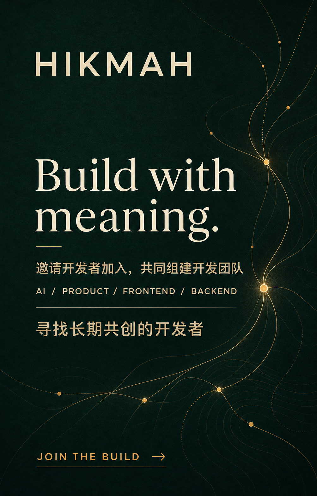
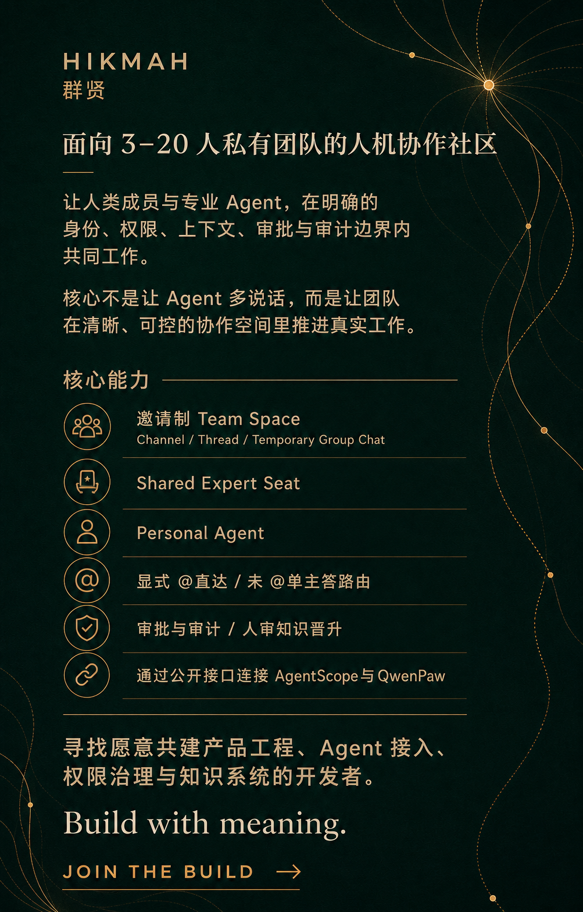

# Hikmah（群贤）

[Apache-2.0](LICENSE) · 设计与复用验证阶段 · GitHub: [hrygo/hikmah](https://github.com/hrygo/hikmah)

> Hikmah 是面向 3–20 人私有团队的轻量人机协作治理层：让人类与专业 Agent 在清晰的身份、权限、上下文、审批和审计边界内共同工作。

> **当前状态：设计与 Foundation Reuse Spike 阶段。** 仓库尚无产品代码、可运行测试或 CI；Proposed 状态的 ADR 不能视为已批准的实现决定。

## What is Hikmah?

Hikmah（群贤）不是另一个从零建设的聊天平台，也不是新的通用 Agent 运行时。它位于成熟的 Collaboration Foundation、AgentScope 与 QwenPaw 之上，只保留 Hikmah 特有的薄治理与编排能力：

- Expert Seat 与 Foundation/QwenPaw Runtime Binding；
- Team / Channel Coordinator Sidecar 的静默、显式 @抑制和未 @单主答规则；
- Personal Agent 的 owner-only 绑定、最小上下文和显式分享；
- 人审 Knowledge Promotion、来源、作用域、版本和撤回；
- 跨 Foundation、AgentScope、QwenPaw、工具、审批和 Trace 的 Correlation Record；
- 部署适配、能力探测、契约测试和升级门禁。

~~~mermaid
flowchart LR
  C[Human client] --> F[Collaboration Foundation]
  F --> S[AgentScope sidecars]
  F --> Q[QwenPaw channels]
  S --> H[Hikmah thin governance]
  Q --> H
~~~

Foundation 是协作事实源；AgentScope 和 QwenPaw 是各自运行事实源；Hikmah 不把三者复制成第四套完整状态。

## Current focus

当前优先事项不是立即编写产品全栈，而是完成同一组验收场景下的 Foundation Reuse Spike：

1. Mattermost：技术首选，许可与品牌是硬门禁；
2. Zulip：Apache-2.0 首要备选，通过公开 Channel Plugin 集成；
3. Open WebUI Channels：AI 原生对照，验证许可证和身份隔离；
4. CircleChat：功能形态对照，当前只用于 Borrow 和隔离验证。

具体候选排序、验收场景和退出条件见 [ADR-0002](docs/decisions/0002-collaboration-foundation-spike.md)。最终 Foundation 尚未批准，不能把候选名称当作已选依赖。

## Technology baseline

未来产品代码采用 Python + React 的类型安全、异步优先基线：

### Backend

- Python 3.14.x、FastAPI、Pydantic v2；
- SQLAlchemy 2.x + Alembic，用于 Hikmah 自有薄层数据和迁移；具体数据库部署由 Slice implementation plan 固定；
- uv 管理 Python 版本、虚拟环境、依赖和锁文件；
- Ruff 负责 lint/format，mypy --strict 负责类型门禁，pytest 负责单元和集成测试。

### Frontend

- React 19.2.x、TypeScript 6.x、Vite 8.x；
- Node.js 24 LTS、pnpm；
- TanStack Query 管理服务端状态，React Router 管理路由，局部 UI 状态优先使用 React 原生状态；
- Vitest 和 Playwright 负责组件/单元与跨浏览器端到端验收。

### Contracts and realtime

- FastAPI 生成版本化 OpenAPI；前端从 OpenAPI 生成 TypeScript 类型与客户端，不手工维护两套公共接口模型；
- API 错误使用统一结构化错误对象，系统边界校验外部输入和第三方响应；
- 流式 Agent 事件优先使用 SSE；需要双向实时控制、取消或连接状态同步时使用 WebSocket；
- 未来代码边界为 apps/api、apps/web、packages/api-client、tests/e2e、docs、infra；本次不创建空应用。

版本选择记录基于 2026-08-28 的官方资料：[Python 3.14.7](https://www.python.org/downloads/release/python-3147/)、[React 19.2](https://react.dev/versions)、[Vite 8](https://vite.dev/blog/announcing-vite8)、[Node.js 24 LTS](https://nodejs.org/en/about/previous-releases)、[TypeScript 6.0](https://www.typescriptlang.org/docs/handbook/release-notes/typescript-6-0.html)、[FastAPI](https://fastapi.tiangolo.com/release-notes/)、[uv](https://docs.astral.sh/uv/guides/projects/)、[Ruff](https://docs.astral.sh/ruff/) 和 [Playwright](https://playwright.dev/)。

## Roadmap

- [x] 完成产品愿景、身份边界、Sidecar 行为、Personal Agent 隐私和知识晋升设计；
- [x] 完成复用优先调研与轻量治理控制层修订；
- [ ] 完成 Foundation Reuse Spike，并用 Accepted ADR 记录最终选择；
- [ ] 在选定 Foundation 上实现 Expert Seat Binding、Sidecar Rule Profile、Personal Agent Binding、Knowledge Promotion 和 Correlation Record；
- [ ] 建立 OpenAPI 契约测试、权限/隐私回归、故障降级和兼容升级门禁。

## Documentation

### Product and architecture

- [产品与技术架构设计](docs/superpowers/specs/2026-08-28-hikmah-design.md)
- [GitHub 复用调研与组件决策矩阵](docs/research/2026-08-28-github-reuse-landscape.md)
- [ADR-0001：复用优先的轻量治理控制层](docs/decisions/0001-reuse-first-thin-control-plane.md)
- [ADR-0002：Foundation Reuse Spike](docs/decisions/0002-collaboration-foundation-spike.md)
- [设计批准与修订记录](docs/design-book/approval-record.md)
- [HTML 设计册](docs/design-book/hikmah-design-book.html)
- [交互画布源材料](docs/design-book/source-screens/README.md)

### Repository decisions

- [仓库初始化与技术栈设计](docs/superpowers/specs/2026-08-28-hikmah-github-bootstrap-design.md)
- [仓库初始化实施计划](docs/superpowers/plans/2026-08-28-hikmah-github-bootstrap.md)

## Upstream boundaries

Hikmah 通过公开 API、Bot、Webhook、Plugin 和开放协议集成 Foundation、AgentScope 与 QwenPaw：

- 不 vendor 上游源码，不直接读写上游私有数据库；
- 不维护长期私有 fork，不使用未合并的上游补丁；
- 只有通用扩展点才向对应上游提交最小 PR，并在正式发布后固定版本；
- 每个集成通过能力探测、契约测试和兼容升级验证。

详见 [CONTRIBUTING.md](CONTRIBUTING.md) 和 [SECURITY.md](SECURITY.md)。

## Contributing

- [贡献指南](CONTRIBUTING.md)
- [行为准则](CODE_OF_CONDUCT.md)
- [安全政策](SECURITY.md)
- [Apache License 2.0](LICENSE)

欢迎围绕产品边界、复用候选、隐私治理和可验证的实现方案提交 Issue。请勿在公开 Issue 或 PR 中发布凭据、私有数据、可利用的安全细节或模型私有推理。

## Join the build

