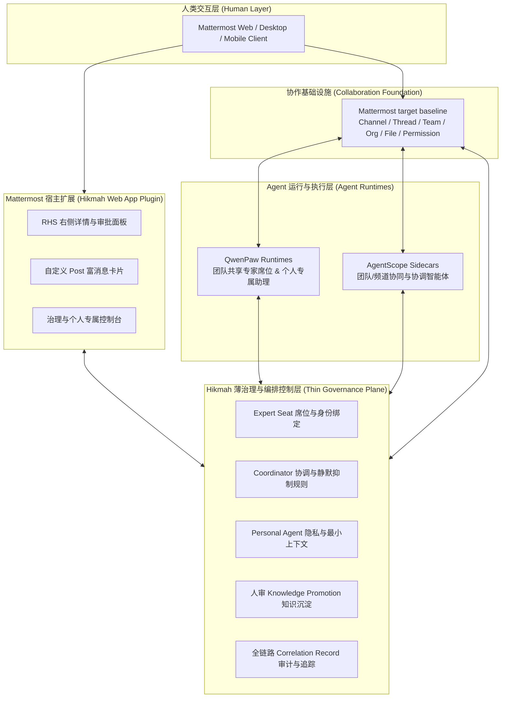

# Hikmah（群贤）

<p align="center">
  <strong>面向 3–20 人私有团队的轻量人机协作治理与编排层</strong>
</p>

<p align="center">
  <a href="LICENSE"></a>
  
  
  
  
  
  
</p>

---

> **💡 核心愿景**  
> Hikmah（群贤）旨在为小型私有团队提供**轻量级人机协作治理层**：让人类团队成员与专业 Agent 在清晰的**身份、权限、上下文、审批和审计边界**内高效共同工作。

> **📌 当前项目状态：目标架构已选型，现有代码为架构脚手架**
> 团队已通过 [ADR-0003](docs/decisions/0003-adopt-mattermost-as-collaboration-foundation.md) 选择 **Mattermost** 作为目标协作数据面与 UI 宿主；精确版本见[目标版本基线](docs/architecture/version-baseline.md)。仓库中的 FastAPI、React Plugin 和集成服务仅用于表达设计边界，不代表真实联调、生产安全或运行门禁已经通过；未闭环事项见 [PRD 与技术架构方案审查跟踪表](docs/project/prd-architecture-review-tracker.md)。

---

## 📖 目录

- [✨ 什么是 Hikmah？](#-什么是-hikmah)
- [🏛️ 核心架构与事实源](#️-核心架构与事实源)
- [🎯 六大目标治理能力](#-六大目标治理能力)
- [🏢 协作底座选型：Mattermost (ADR-0003)](#-协作底座选型mattermost-adr-0003)
- [🛠️ 技术基线 (Technology Baseline)](#️-技术基线-technology-baseline)
- [🗺️ 路线图 (Roadmap)](#️-路线图-roadmap)
- [📚 文档导航 (Documentation)](#-文档导航-documentation)
- [🛡️ 上游边界与集成原则](#️-上游边界与集成原则)
- [🤝 参与贡献与交流](#-参与贡献与交流)

---

## ✨ 什么是 Hikmah？

Hikmah（群贤）**不是**另一个从零建设的聊天系统，也**不是**新的通用 Agent 运行时。

我们遵循 **“复用优先”** 原则，深度聚焦并唯一绑定三大基石：
- 🏢 **协作底座 (Collaboration Foundation)**：**Mattermost**（组织架构、沟通流与 UI 宿主）
- 🧠 **专家与个人 Agent 运行时 (Expert & Personal Agent Runtime)**：**QwenPaw**（驱动团队共享专家席位与个人专属助理的单 Agent 执行、工具调用、Skills 与本地/设备端 Runtime）
- 🤖 **团队多智能体协同框架 (Multi-Agent Collaboration Framework)**：**AgentScope**（驱动团队/频道 Coordinator Sidecar 协调机制、跨 Agent 协作与复杂工作流编排）

> 🔒 **架构定力**：Hikmah **专注深耕 QwenPaw 与 AgentScope**，不考虑也不引入其他多余的 Agent 运行时选型，专注于提供**专属于 Hikmah 的薄治理与编排能力**：



---

## 🏛️ 核心架构与事实源

Hikmah 严格保持职责单一与事实源唯一，不把各方状态复制成第四套重型系统：

| 组件层级 | 角色定位 | 事实源 (Source of Truth) |
|---|---|---|
| **Mattermost** | 组织架构、消息流、频道、线程、权限底座与 UI 宿主 | **协作与通信事实源** |
| **QwenPaw** | 团队共享专家 Agent 与个人私有 Agent 执行、工具调用与端侧运行时 | **专家与个人 Agent 运行事实源** |
| **AgentScope** | 团队级多 Agent 协作、工作流编排与频道 Coordinator Sidecar 协调 | **多 Agent 协同与协调事实源** |
| **Hikmah Control Plane** | 席位映射、协调规则、审批晋升、关联审计 | **治理与编排事实源** |

---

## 🎯 六大目标治理能力

| 维度 | 能力特性 | 解决的核心痛点 |
|---|---|---|
| 🪑 **Expert Seat Binding** | 专家席位与运行时绑定 | 将团队共享 QwenPaw Workspace 映射为 Mattermost 专属 Bot 席位，保持身份边界与审计关联清晰 |
| 🤖 **Coordinator Sidecar** | 智能协调与消息抑制 | 支持频道静默观察、显式 @ 抑制策略、未 @ 单主答规则，杜绝群聊刷屏 |
| 🔒 **Personal Agent Isolation** | 个人助理隐私安全 | 坚持 Owner-only 专属绑定，执行最小上下文流转，未经用户显式授权绝不向外暴露 |
| 📚 **Knowledge Promotion** | 知识人审晋升机制 | 将群聊对话沉淀为团队资产，具备清晰的来源溯源、作用域隔离、版本管理与撤回能力 |
| 🔗 **Correlation Record** | 跨系统关联与审计 | 统一串联 Mattermost、AgentScope、QwenPaw、工具调用、审批流与 Trace 日志 |
| 🛡️ **Adaptive Integration** | 部署适配与升级门禁 | 动态能力探测、OpenAPI 契约测试、兼容升级验证，保障私有化交付可靠性 |

---

## 🏢 协作底座选型：Mattermost (ADR-0003)

经过架构与源码调研，Hikmah 选定 **Mattermost** 作为目标协作底座。运行态 Spike、升级及许可证/品牌门禁仍按 [AR-001 与 AR-007](docs/project/prd-architecture-review-tracker.md) 跟踪：

| 选型考量 | 决议依据与方案 |
|---|---|
| **UI 宿主模式** | 采用 **Mattermost Web App Plugin** 嵌入 React 19 组件（RHS 右侧面板、自定义 Post 渲染），无需从头开发全套聊天客户端。 |
| **通信与事件** | 通过 Mattermost 官方 REST API (v4) 与 WebSocket 事件流实现双向消息编排与 Sidecar 监听。 |
| **个人 Agent 隔离** | 不将 Personal Agent 暴露为公共 Bot，通过 Hikmah Owner 专属工作台保护私有上下文。 |
| **合规与演进** | 进程/接口隔离是工程边界；每种分发方式必须完成许可证/品牌复核，每个目标版本必须通过兼容升级与回退门禁。 |

> 📋 完整决议内容请参阅 [ADR-0003：选定 Mattermost 作为协作底座](docs/decisions/0003-adopt-mattermost-as-collaboration-foundation.md) 与 [WebUI 整合深度调研报告](docs/research/2026-08-28-mattermost-zulip-webui-integration.md)。

---

## 🛠️ 技术基线 (Technology Baseline)

正式实现采用类型安全、异步优先、高内聚低耦合的技术栈。精确版本、支持语义和发布证据由[目标版本与发布基线](docs/architecture/version-baseline.md)唯一维护；下列内容是目标摘要，不代表脚手架 manifest 已经对齐：

### 🖥️ 后端架构 (Backend)
- **Runtime & Framework**: [Python 3.14.x](https://www.python.org/downloads/) · [FastAPI](https://fastapi.tiangolo.com/) · [Pydantic v2](https://docs.pydantic.dev/)
- **ORM & Database**: [SQLAlchemy 2.x](https://docs.sqlalchemy.org/) · [Alembic](https://alembic.sqlalchemy.org/)（专注于 Hikmah 自有薄层数据与迁移）
- **Package & Environment**: [uv](https://docs.astral.sh/uv/)（统一管理 Python 版本、虚拟环境与依赖锁）
- **Code Quality**: [Ruff](https://docs.astral.sh/ruff/)（Lint & Format）· `mypy --strict`（严格类型门禁）· [pytest](https://pytest.org/)（单元与集成测试）

### 🌐 前端架构 (Frontend)
- **Core & Framework**: [React 19.2.x](https://react.dev/) · [TypeScript 6.0.x](https://www.typescriptlang.org/) · [Vite 8.x](https://vite.dev/)
- **Runtime & Tools**: [Node.js 24 LTS](https://nodejs.org/) · [pnpm](https://pnpm.io/)
- **Host Integration**: Mattermost Web App Plugin API（向 Mattermost 注入 RHS、Custom Post、Header 控件）
- **State & Routing**: [TanStack Query](https://tanstack.com/query)（服务端状态管理）· [React Router](https://reactrouter.com/)
- **Testing**: [Vitest](https://vitest.dev/)（单元/组件测试）· [Playwright](https://playwright.dev/)（端到端 E2E 验收）

### 📡 契约与实时流 (Contracts & Realtime)
- **API Contract**: FastAPI 自动导出 OpenAPI Spec，前端自动化生成 TypeScript 客户端与类型定义，杜绝双重维护。
- **Realtime**: 流式 Agent 响应优先采用 **SSE (Server-Sent Events)**；双向控制、任务取消及交互状态采用 **WebSocket**。
- **Monorepo Layout**: 未来统一在 `apps/api`、`apps/web`、`packages/api-client`、`tests/e2e`、`docs` 与 `infra` 下演进。

---

## 🗺️ 路线图 (Roadmap)

具体行为以[产品规范第 17 节](docs/product/overview.md#17-试点与完整-mvp-交付顺序)和 [ADR-0007](docs/decisions/0007-knowledge-collaboration-pilot-and-runtime-boundaries.md)为准；[长期路线图](docs/project/long-term-roadmap.md)统一管理隔离资格、知识价值、有限自动协作、个人/业务执行、完整 MVP 和持续演进，避免维护多套阶段编号。

研发接续从[团队交接入口](docs/project/handoff/README.md)开始，按[实施总览](docs/development/plans/2026-09-05-implementation-roadmap.md)、[工作项队列](docs/development/plans/2026-09-05-work-item-sequence.md)和[状态账本](docs/project/handoff/state.json)推进。2026-09-05 交接时产品仍为脚手架，运行门禁尚未完成，不能据文档或单元测试勾选生产能力。

---

## 📚 文档导航 (Documentation)

项目拥有系统完整的文档体系，建议从 [**文档中心 (docs/README.md)**](docs/README.md) 开始查阅：

```
docs/
├── product/          # 产品愿景、需求范围、行为规范与产品级架构
├── architecture/     # 系统地图、组件边界、技术拓扑与集成方案
├── decisions/        # 架构决策记录 (ADR-0001, ADR-0002, ADR-0003)
├── research/         # 外部复用调研、源码分析与 Spike 评估报告
├── design/           # HTML 交互设计册与设计批准修订记录
├── development/      # 开发规范、环境搭建与质量标准
└── project/          # 文档治理规则、Metadata 规范与架构审查跟踪
```

### 🌟 核心文档直达

- 📑 **产品总览**：[产品与技术架构设计说明书](docs/product/overview.md)
- 🗺️ **系统架构**：[架构导航与事实源地图](docs/architecture/README.md)
- 📦 **目标版本**：[目标版本与发布基线](docs/architecture/version-baseline.md)
- 🧭 **审查跟踪**：[PRD 与技术架构方案审查跟踪表](docs/project/prd-architecture-review-tracker.md)
- ⚖️ **架构决策**：
  - [ADR-0001：复用优先的轻量治理控制层](docs/decisions/0001-reuse-first-thin-control-plane.md)
  - [ADR-0002：Foundation Reuse Spike 评测计划](docs/decisions/0002-collaboration-foundation-spike.md)
  - [ADR-0003：选定 Mattermost 作为协作底座](docs/decisions/0003-adopt-mattermost-as-collaboration-foundation.md)
  - [ADR-0004：可信身份与 Personal Agent 隔离](docs/decisions/0004-trusted-identity-and-personal-agent-isolation.md)
  - [ADR-0005：公开集成契约与 fail-closed 语义](docs/decisions/0005-public-integration-contracts-and-fail-closed-semantics.md)
  - [ADR-0006：治理元数据持久化与 schema 生命周期](docs/decisions/0006-governance-metadata-persistence-and-schema-lifecycle.md)
- 🔍 **前沿调研**：
  - [GitHub 开源生态复用调研与组件决策矩阵](docs/research/2026-08-28-github-reuse-landscape.md)
  - [Mattermost、Zulip 与 WebUI 整合可行性深度调研](docs/research/2026-08-28-mattermost-zulip-webui-integration.md)
- 🎨 **视觉与交互**：[Hikmah Design Book (HTML 设计册)](docs/design/hikmah-design-book.html)


---

## 🛡️ 上游边界与集成原则

Hikmah 坚持以非侵入方式与上游系统集成：

1. **零侵入协议交互**：仅通过公开 API、Bot、Webhook、官方 Plugin 机制及开放协议进行交互，**不 vendor 上游源码**，**不直读直写上游私有数据库**。
2. **拒绝私有 Fork**：不维护长期私有代码分叉，不依赖未经上游合并的私有补丁。
3. **最小扩展上游回馈**：若遇底层能力缺失，优先向官方上游提交通用 PR，并在正式版本发布后固定依赖。
4. **防御性集成**：通过能力探测 (Capability Probing)、契约测试 (Contract Testing) 与兼容升级验证保障集成稳定性。

---

## 🤝 参与贡献与交流

我们欢迎关于人机协作治理、多 Agent 协调机制、隐私边界以及可验证实现方案的深入探讨与贡献：

- 📘 [贡献指南 (CONTRIBUTING.md)](CONTRIBUTING.md)
- 🔒 [安全政策 (SECURITY.md)](SECURITY.md)
- 📜 [行为准则 (CODE_OF_CONDUCT.md)](CODE_OF_CONDUCT.md)
- 📄 [开源许可 (Apache-2.0 License)](LICENSE)

> ⚠️ **温馨提示**：请勿在公开 Issue、PR 或讨论中泄露 API 密钥、私有团队凭据或未脱敏的模型推理数据。

---

## 👥 Join the Build

<p align="center">
  
  
</p>
