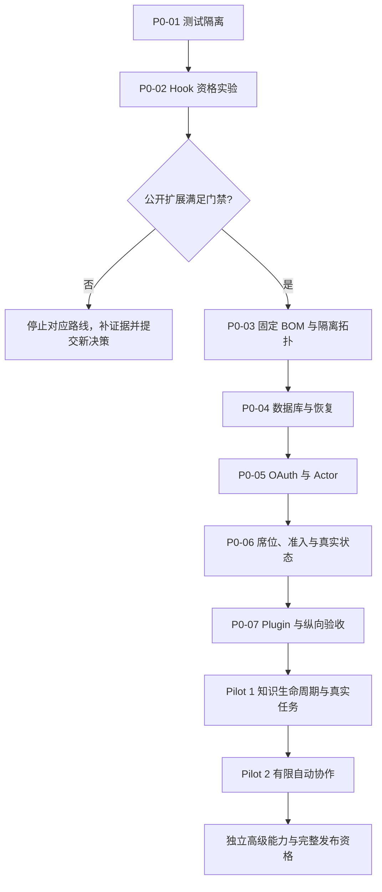

# Hikmah 知识协作实施总览

> 执行者：使用当前可用的 `executing-plans` 技能逐项执行；默认单 Agent，只有用户明确授权后才并行。下列清单均未执行。生成计划不授权代码、安装、部署、真实数据接入或发布。

**目标：** 从当前脚手架形成可验证的知识问答与方案协作试点，再按证据开放自动协作和完整 MVP 能力。

**架构：** 保持 Mattermost 为协作事实源、QwenPaw 为专家运行时、AgentScope 为协调运行时。Hikmah 实现可信身份、窄准入、知识规范对象及关联审计；公开 Hook 能否满足故障拒绝是先行资格门禁，不预设验证成功。

**技术栈：** FastAPI、SQLAlchemy/Alembic、PostgreSQL、React Mattermost Plugin；测试使用 pytest、Vitest 和独立契约/E2E 套件。

**规范：** [PRD](../../product/overview.md)、[ADR-0007](../../decisions/0007-knowledge-collaboration-pilot-and-runtime-boundaries.md)、[ADR-0004](../../decisions/0004-trusted-identity-and-personal-agent-isolation.md)、[ADR-0005](../../decisions/0005-public-integration-contracts-and-fail-closed-semantics.md)、[ADR-0006](../../decisions/0006-governance-metadata-persistence-and-schema-lifecycle.md)。PRD 定义行为，本文定义实施顺序。

## 1. 全局约束

- 计划基线：Hikmah `080c903`，2026-09-05；代码仍来自 `8ea48c2` 之前的脚手架。本计划中的新文件、接口、fixture、测试和命令入口均是计划交付物，不是现有能力。
- 固定目标：Mattermost `v11.10.1`，QwenPaw `v2.2.0-beta.1`，AgentScope `v2.0.7.post1`；参考插件 `v2.6.0`。Python `>=3.14,<3.15`、PostgreSQL `16`、React `19.2.x`、TypeScript `6.0.x`、Vite `8.x`、Node.js `24 LTS`、pnpm `11.21.x`。精确解析版本及 digest 在 BOM 任务冻结，见[版本基线](../../architecture/version-baseline.md)。不擅自降低版本或升级上游。
- 上游只读，不 vendor、monkey patch、读写私有数据库或依赖未发布补丁；禁止自建通用 Gateway、工作流和审批引擎。
- 试点每席位单 Channel；独立记忆、凭据和受限执行环境；先做知识读取/草稿工具。正常回复仅预授权回写原 Thread，知识发布仍需人审。
- 显式 @不重新选专家；专家准入与 Sidecar 分离；未知执行结果不自动重试，缺失治理不能回落为成功。
- 私密数据只留在获准的运行环境；仓库内仅合成 fixture、代码和脱敏证据。Secret 使用受控存储，配置和模型工具只获得引用；不得把真实凭据放进命令参数。
- Python 严格类型；TypeScript 严格检查；不引入 `Any`/`any` 或吞掉 lint 错误。外部接口变动同步 API Client、Web、OpenAPI 和文档。
- 分支基于获准的实现基线创建；保留现有用户改动。每项任务对应可独立审阅的提交/PR，关联真实 Issue，标签取自 `.github/labels.yml`。本计划不复用此前对 PR #4 的管理员合并授权。

## 2. 当前事实与顺序依据

| 现场证据 | 实施影响 |
|---|---|
| `apps/api/tests/conftest.py` 复用全局 Engine 并 `drop_all` | P0-01 通过前不执行旧 API 测试套件；新安全测试放到独立 `tests/unit/` |
| `models/base.py` 导入时建 Engine，`main.py` 启动 `create_all` | 应用工厂和 DB 注入先落地，生产/资格环境仅允许 Alembic |
| `services/foundation.py` / `runtime.py` 有模拟成功 | 真实配置下明确状态；无 Token、失败和未知结果不能计为 ready/completed |
| Seats 接受 `user_id`，Knowledge 接受 reviewer 身份 | 真实数据前建立 OAuth/BFF Actor 和集中授权 |
| `plugin.tsx` 有注册，Vite 仍是 SPA 配置；TS/Vite manifest 范围落后目标 | 先冻结 BOM，再交付真正可安装的 Plugin；保留 `com.hrygo.hikmah` id |
| 原生 QwenPaw 提及判断宽匹配；Hook 位于上下文读取之后 | 先验证公开扩展的完整入口/故障语义，读取隔离单独验收 |

证据来自图谱定位、关键源码直接读取及[固定版本研究](../../research/2026-09-05-knowledge-collaboration-feasibility.md)。图谱覆盖检查对已读代码为 `metadata_match`；依赖注入和跨服务关系不以图谱无边证明不存在。

## 3. 执行依赖与评审点



P0-02 的最小实验依赖隔离实验执行授权和可用目标运行时；可以编写静态/合成测试，但没有隔离运行环境就不能关闭该门禁。P0-03 构建长期可重复的部署拓扑；不得借此前实验使用未固定版本放行。

| 工作包 | 可审阅交付物 | 对应跟踪 | 退出评审 |
|---|---|---|---|
| [Pilot 0](2026-09-05-pilot-0-foundation.md) | 测试不误连、公开 Hook 证据、隔离环境、迁移/恢复、可信 Actor、单专家准入、Plugin 包 | AR-001/002/003/004/006/007/009/010 | 仅合成数据的完整纵向链路与故障测试 |
| [Pilot 1](2026-09-05-pilot-1-knowledge.md) | 人审知识规范对象、受众检索、引用、撤回、Web 操作、真实任务报告 | AR-011/012、CR-013/014 | 安全逐项通过，业务效果有人类复核 |
| [Pilot 2](2026-09-05-pilot-2-coordination.md) | 确定性路由、AgentScope 窄适配、一层邀请和持久预算 | AR-005/010、CR-006/007/012 | 显式 @零介入、无递归邀请、重放无重复执行 |

每份子计划按任务给出文件、接口、失败用例、实施步骤和提交边界。示例测试定义关键断言；同项列出的负向用例必须补齐，不能只运行示例就宣称验收完成。

现有代码候选的覆盖映射如下，供建立实现 Issue 时关联；此表不改变授权状态：

| 跟踪项 | 任务 |
|---|---|
| CR-001 可信身份 | P0-05 |
| CR-002 共享/个人边界 | P0-06；完整个人能力进入 PA |
| CR-003 Runtime 契约 | P0-02/06；个人 Console/SSE 进入 PA |
| CR-004 Foundation 失败语义 | P0-06 |
| CR-005 Plugin 交付 | P0-07 |
| CR-006 纵向适配 | P0-07、P2-02/03 |
| CR-007 路由规则 | P2-01～03 |
| CR-008 数据库与恢复 | P0-01/04、P1-03 |
| CR-009 版本与依赖 | P0-03、RQ |
| CR-010 安全/E2E/NFR | 各阶段验收；完整 AR-008 指标进入 RQ |
| CR-011 Runtime 隔离 | P0-02/03/07；个人隔离进入 PA |
| CR-012 准入与预算 | P0-02/06、P2-02/03 |
| CR-013 知识生命周期 | P1-01～03 |
| CR-014 真实试点 | P1-04 |

## 4. 完整终态覆盖与高级能力排期

| PRD 要求 | 交付位置 |
|---|---|
| 私有 Team、邀请、Channel/Thread、Bot | 复用 Mattermost，P0-03/05/07 核验权限旅程 |
| Shared Expert 直达、最小上下文、关联审计 | P0-02/06/07 |
| 知识人审、版本、受众和撤回 | P1-01～04 |
| 无 @单主答、有限邀请与两级 Sidecar | P2-01～03 |
| Personal Agent owner-only、本机出站与显式分享 | 后续 PA 工作包；不得借共享席位开关提前启用 |
| 精确参数审批、业务副作用执行与恢复 | 后续 EX 工作包；不得将普通回帖预授权扩展到工具写操作 |
| 升级/回退、恢复、供应链及全部量化 NFR | P0 开始积累，最终 RQ 工作包完整验收 |

后续独立任务的明确交付边界：

- [ ] **PA：个人代理。** 先形成连接与身份子规范：在受控本机出站连接和可信 Hub 托管中选择本次实现模式，逐段列明数据可见者；定义独立 `PersonalAgentBinding`、撤销及分享快照契约。随后编写独立实施计划，范围为 `api/v1/personal_agents.py`、独立 models/schemas、连接器与 owner-only Web 页；验收其他成员、Team Admin 枚举/调用均失败，分享只生成被选内容，断连/撤销停止新工作。基础设施管理员威胁模型发生变化时先新 ADR。
- [ ] **EX：业务执行。** 先选一个有明确回退方式的实际业务工具；固定其运行时 proposal/approval/execution 契约和审批者权限，再编写独立实施计划。验收参数替换、审批重放、过期、超时、撤销和重复点击；未知状态不得自动再次执行，普通 Bot 回帖许可不得放行该工具。
- [ ] **RQ：完整发布资格。** 汇总唯一 BOM、容器 digest、SBOM、许可证/品牌复核、核心旅程、升级/回退与隔离恢复报告。在 PRD 20 人、50 Channel、20 活跃 Thread、10 并发 task 口径测量 API、路由、状态、审计与 RPO/RTO。完整证据通过前只标记试点范围，不能标记生产支持。

上述子规范和计划任务是后续工作的入口，不假定其当前尚未选择的连接或业务工具契约。已有 Pilot 0～2 可分别授权执行；未来 PA/EX 的独立设计评审不会阻止已通过门禁的知识试点。

## 5. 验证与证据格式

每项任务先写失败用例，确认失败原因，再实现最小行为、运行针对性验证、自审差异并提交。先执行 P0-01 的数据库安全保护，再执行任何旧 API suite。每次端到端实验记录：commit、BOM/digest、profile、数据类别、用例及预期、实际结果、时间、脱敏日志/Trace、失败项、复核人；缺少字段即不关闭门禁。

代码变动后的完整本地门禁（新插件包的独立检查在对应子计划补充）：

```bash
uv run ruff format --check .
uv run ruff check .
uv run mypy apps/api/src apps/api/tests
uv run mypy tests/unit
uv run pytest tests/unit -v
uv run pytest apps/api/tests -v
pnpm run typecheck
pnpm run test
pnpm run build
git diff --check
```

这些命令是将来的验证步骤，本次仅生成计划。数据库恢复、外部 Post、真实知识及真实任务评估须在获准目标上执行，不能因为命令出现在计划里而自动取得授权。

## 6. 回退和授权检查点

- 应用/插件回退到前一个已验证制品，数据库优先前滚兼容或从隔离恢复点恢复；不以 `drop_all`、删除卷或强推作为回退。
- Hook/准入不可用时停止相关专家，保留 Mattermost 人类聊天；不得自动绕过 Hook 或启用模拟成功。
- 知识状态不明时停止受影响检索与发送；已外发内容按有权人的更正/删除流程处理，不宣称原子收回。
- 执行前明确本次工作包和允许的运行环境；首次安装/下载依赖、启动服务、分发插件或使用真实数据时确认该行动已在任务授权中。仅授权代码时停在可审阅制品和合成测试结果。
- 不设置无依据的工期承诺。P0-02 结果决定可行路线，P1-04 的真实任务报告决定是否扩大试点。
