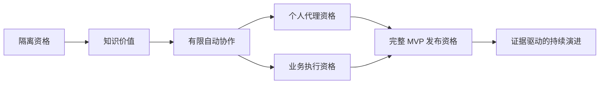

# Hikmah 长期路线图与研发方向约束

本文件依据用户 2026-09-05 的补充要求，将长期方向和能力开放顺序固定为团队工作约束。产品行为以 PRD 和 Accepted ADR 为准，精确版本以版本基线为准；本文管理路线，实施总览管理工作包，任务卡管理一次交付，跟踪表管理实际证据。路线明确不表示功能已实现或已授权执行。

## 1. 长期终态

Hikmah 服务 3–20 人邀请制私有团队，让人类与专家 Agent 在 Mattermost 的同一协作空间中完成知识问答、方案协作和可审计的受控执行。团队知识经过人审而形成，个人上下文由 owner 控制，自动协作受到明确规则限制。

长期积累的核心资产是可信绑定、可复核的知识版本、窄治理规则、跨系统关联证据，以及可靠的集成与升级能力。功能数量、Agent 数量和自动发帖数量不能代表产品价值。

| 持续成立的约束 | 研发中可检查的表现 | 禁止用来替代它的局部捷径 |
|---|---|---|
| 复用协作底座 | 消息、成员、文件和权限由 Mattermost 拥有 | 自建聊天客户端或消息权威副本 |
| 薄治理 | QwenPaw 执行专家任务，AgentScope 协调，Hikmah 记录治理元数据 | 自建通用 Gateway、TaskRun、工作流或审批引擎 |
| 人类保持控制 | 显式 @原目标直达；自动主答与邀请有持久预算 | 自动改派、递归邀请、用模型分数提升权限 |
| 知识可追溯 | 人审精确版本、目标受众、引用、撤回均有效 | 把会话总结或向量索引当已发布知识 |
| 私密内容隔离 | 最小上下文、分频道信任域、独立个人绑定 | 把 session 名称或 UI 隐藏当安全边界 |
| 失败诚实可见 | 权威未知时待核验，治理缺失时拒绝 | mock success、未知结果自动重发 |
| 可维护和可恢复 | 固定 BOM、公开契约、迁移与恢复证据 | 长期私有 fork、私库访问、清库升级 |

这些约束适用于完整 MVP 之后的版本，不能因试点指标好看或上游功能更多而自动取消。

## 2. 阶段地图

阶段按证据推进；在没有真实吞吐和风险消除结果前不指定季度、发布日期或人日。技术负责人每完成一个工作包，用实际执行/评审/返工记录更新下一窗口的范围预估；产品负责人决定投入与优先级。

| 阶段 | 用户可获得的价值 | 必须交付 | 进入条件 | 退出决定及保持关闭的能力 |
|---|---|---|---|---|
| M0 隔离资格 | 仅合成场景证明基本链路可行 | P0-01～07：安全测试、Hook、BOM、DB、身份、专家准入、Plugin | 代码/实验目标各自获准 | 技术负责人确认硬门禁通过；真实数据、自动协作、个人和业务写工具关闭 |
| M1 知识价值 | 明确 @问答、方案比较、人类邀请、引用、人审与撤回 | P1-01～04：知识完整生命周期、至少 30 个真实任务报告 | M0 通过；M1 真实运行前完成其安全/恢复/许可与资料授权 | 产品负责人依据质量、返工、成本决定扩大；自动协作/个人/业务写工具关闭 |
| M2 有限自动协作 | 无 @协作意图下选主答并有限邀请 | P2-01～03：完整路由表、两级 Sidecar、预算/重放/故障证据 | M1 报告已复核、扩大范围获准 | 技术负责人关闭阶段门禁，产品负责人批准开放；个人/业务写工具关闭 |
| M3 独立高级能力 | 个人私有协作与受人类控制的业务执行 | PA 与 EX 各自设计→实现→资格→开放 | M2 后按获准单项范围推进；PA/EX 不互为技术前置 | 各能力独立验收；某项失败只关闭其能力及受影响依赖，不能豁免完整目标 |
| M4 完整 MVP 支持版本 | 所有正式成功标准与可靠交付承诺 | RQ：完整功能矩阵、升级/回退、许可证、SBOM、恢复、全部 NFR | M0～M3 所需能力全部有真实证据 | 负责人签署支持矩阵；没有完整证据仍只能称受限试点 |
| M5 持续演进 | 提高同一目标团队的使用质量和运维稳定性 | 每个版本选择有实测问题支持的质量/成本/可靠性改进 | M4 通过并有真实使用记录 | 每次新增能力重新设计评审；扩用户规模、租户模式或底座均不在自动授权内 |

PA 与 EX 在逻辑依赖上独立，不表示已授权并行人员或 Agent。每个阶段进入后仍持续承担前序安全不变量；发现基础能力失效时回到受影响门禁。

## 3. 高级能力的固定成果和设计责任

| 工作包 | 设计负责人必须先解决 | 实施切片 | 不可缩减的验收 |
|---|---|---|---|
| PA | 本次本机出站或托管模式、可信运维方、身份/连接撤销、分享快照与保留策略 | PA-D 契约与威胁模型 → PA-I 独立 Binding/连接 → PA-U owner 界面/分享 → PA-Q 资格 | 其他成员/治理 Admin 无权枚举调用；断连与撤销停止新工作；分享只包含 owner 选择内容；托管不承诺防基础设施管理员读取 |
| EX | 一个实际可回退业务工具、精确参数/摘要/nonce、运行时原生审批者、取消和未知结果恢复 | EX-D 工具与批准契约 → EX-I 原生审批投影/执行关联 → EX-Q 故障与重放资格 | 人类身份有效；参数改变重审；过期/撤销/重放拒绝；未知结果不重执行；不新增独立审批状态机 |
| RQ | 唯一版本组合、支持边界、许可分发方式、测量环境和恢复责任 | RQ-B BOM/供应链 → RQ-J 全旅程 → RQ-N NFR → RQ-R 升级恢复 → RQ-S 支持矩阵 | PRD 全部成功标准与 NFR 有结果、复核人和日期；首次无前版升级证据的缺口必须在进入支持矩阵前补齐 |

PA-D、EX-D 是明确的设计交付任务。负责人不得把“挑一种连接”“找一个工具”“实现审批”原样分配给 worker；先提供固定接口、示例、测试和回退，再发实现任务卡。完整长期方向固定，依赖未来证据的细节逐阶段冻结。

## 4. 工程与产品证据分开判断

技术可行性顺序是：源码提出假设 → 合成负向实验 → 固定版本契约 → 隔离端到端 → 授权真实任务 → 对应规模与发布资格。前一级不能代替后一级；相同强制门禁反复失败时停止对应路线，避免继续建设依赖失败假设的功能。

产品判断使用 PRD 定义的可用率、引用分项、返工时间和每采纳答案成本；分母、失败样本、币种和测量条件一并报告。30 个任务形成学习基线，不自动证明收益、市场需求或统计显著性。安全项逐项判定，不能以综合评分抵消。

完整发布沿用 PRD：单 Team 20 人、50 Channel、20 活跃 Thread、10 并发 task；治理读取/写入 p95 分别不超过 300/500 ms，确定性路由 500 ms，需分类时 3 s，状态投影 2 s；控制面月度目标 99.5%，RPO 24 h、RTO 4 h。测量口径及例外以 [PRD 第 14.1 节](../product/overview.md#141-mvp-量化-nfr)为准，不在任务中私自降低。

## 5. 路线偏离的识别与处理

| 触发事件 | 负责人动作 | worker 可以继续的范围 |
|---|---|---|
| 公开 Hook 缺失/卸载时无法阻断 | 固定失败证据，关闭能力，提出上游改进或窄适配 ADR | 合成观测与被批准的独立任务，不构建依赖该保证的真实链路 |
| React/Plugin 或 Python/上游版本不兼容 | 复核固定版本，提交兼容结论与版本/架构决策 | 本卡范围内的证据收集，不升级降级/私有覆盖 |
| 撤回后旧上下文/已在途发送无法确定 | 停用受影响回答，界定竞态并审阅公开发送扩展 | 可复现用例和日志脱敏，不能宣称原子撤回 |
| 真实任务质量不足或成本过高 | 对照基线定位主要失败类型，再选择一个改进实验 | 已冻结的数据/评分任务，不无限增加 Agent 或新基础设施 |
| 请求跨频道共用可写记忆、扩大团队或改多租户 | 视为边界变化，补产品与威胁模型决策 | 不把原容量/隔离结论直接外推 |
| 发现需要长期 fork、第二聊天客户端或通用执行引擎 | 视为路线偏离，停止相关实现并提交取舍 | 只整理证据和公开替代候选 |

变更记录必须包含问题证据、保留不变量、备选方案、成本与运维影响、数据/接口兼容、回退、被影响任务和决策人。涉及产品承诺或不可逆边界由产品负责人确认；技术负责人可以在既有边界内调整文件拆分、测试实现和任务顺序，并同步记录。用户已经给出的明确授权按原范围有效，不重复询问。

## 6. 团队接续与检查节奏

每次迭代开始，负责人确定当前阶段、唯一可分派队列、阻塞门禁和本次开放范围；迭代结束审阅业务/安全/成本/恢复证据及遗留风险。每次版本升级、权限路径或知识生命周期变化都重跑受影响契约；旧结论带适用 commit/BOM，不自动继承。

每个 Issue 具有 `阶段 → 工作包 → 任务卡 → PR → 验证记录` 的可追溯链。PRD/ADR 冲突先解决事实源；计划与当前实现不符先刷新任务卡；不能让 worker 在两份冲突说明之间自行选择。详见[交付规范](../development/worker-delivery-protocol.md)。
